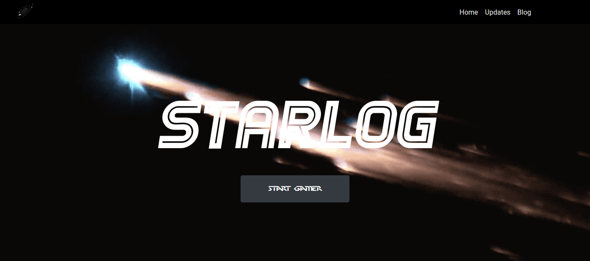
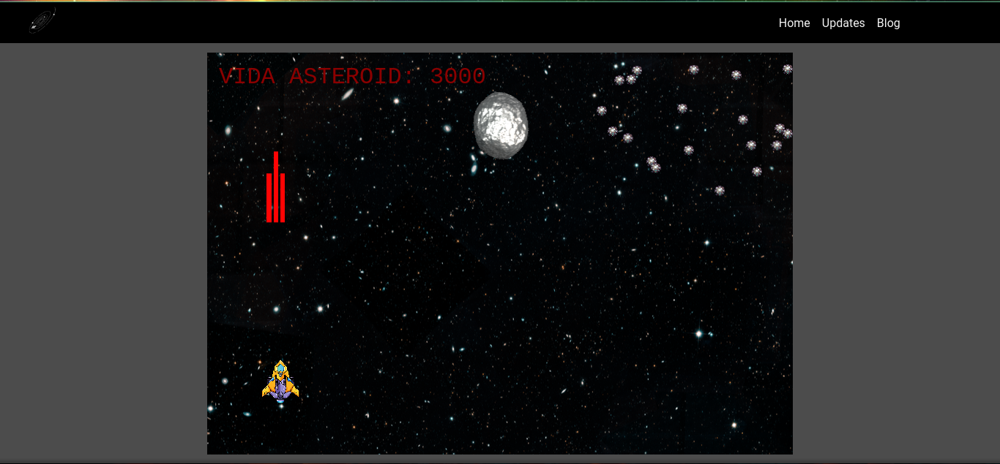

<h1 style="text-align: center;">StarLog</h1>

<h1 align="center">
    
    
</h1>

## Sobre
<p style="text-align: justify;" >Game construido para teste do framework utilizados na construção de jogos
</p>

Você também pode acessar está plicação nesse link [starlog1.herokuapp.com](https://starlog1.herokuapp.com)

---

## Tecnologias utilizadas

<p>O projeto foi desenvolvido utilizando as seguintes tecnologias</p>

 - [NodeJS](https://nodejs.org/en/)
 - [Phaser](https://phaser.io/)
 - [Nodemon](https://nodemon.io/)
 - [express](https://expressjs.com/pt-br/)
 - [bootstrap](https://getbootstrap.com/)

---

## Como baixar o projeto
```bash
    #Clonar repositório
    $ git clone 
    
    #Acessar repositório
    $ cd StarLog-Game
```
---
## Instalando programas e dependência para executar a aplicação.
```bash
#Instalando dependências necessárias para aplicação
$ yarn install

    ou

$ npm install
```

---

### Iniciando aplicação

```bash
    #Inicia aplicação no http:localhost: 2000
    $ yarn dev
```

---

Desenvolvido por Kevson Filipe.